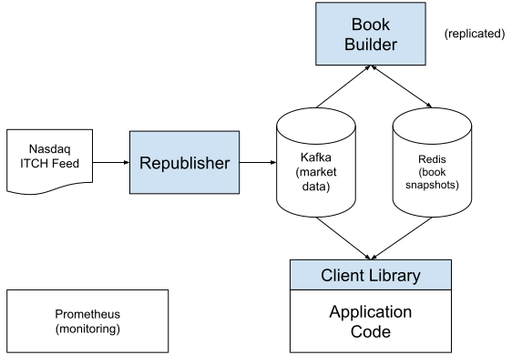
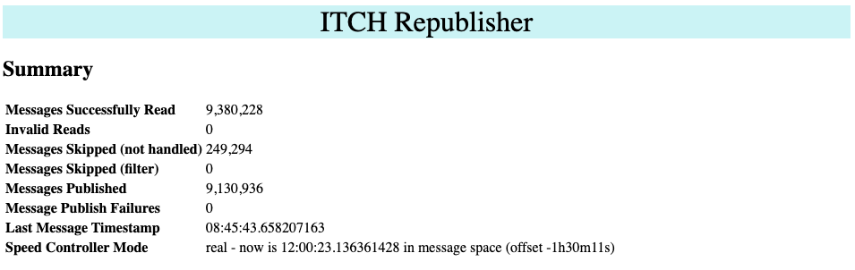
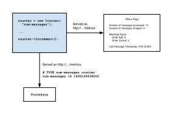
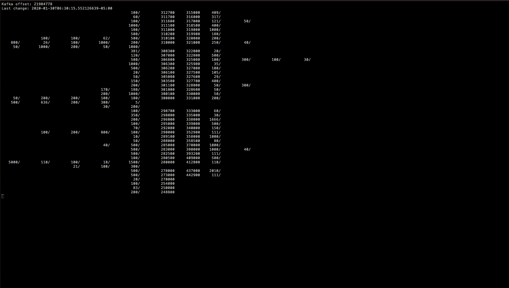

# Order book

Matthew Simmons <simmonmt@acm.org><br>
2023-09-24

[TOC]

## Summary

I designed and built a prototype system that parses market data (the Nasdaq ITCH
equity orders feed), builds order books from it, and makes those books
available to consumers in a highly-resilient highly-scalable way. The prototype
is fully productionized, deployable in Docker, and exports metrics for
monitoring and alerting using Prometheus.

Orders are read from an ITCH sample dump, and are written to Kafka for storage
and distribution. Clients use a thick client library to subscribe to the
Kafka topic containing these messages. The library maintains per-security
order books, and makes both individual messages and whole books available to
clients.

The system is designed to be resilient, allowing clients to crash and recover
at any point during the trading day without having to recreate the order book
from scratch. Recovery is made possible by continuously-updated order book
snapshots which allow the client library to restart the message feed at the
time of the latest snapshot. This allows clients to restart in constant time
rather than having to restart from the beginning of the day's order feed.

The system includes:

- Custom ITCH parser
- Configurable message publisher including several delivery modes
- Order book class including visualizer
- Thick client library enabling easy client development
- Modernized C++ wrapper around rdkafkacpp (includes Admin interface)
- Metrics class that automatically exports to Prometheus
- Extensive unit and integration testing
- Administrative tooling and Docker Compose files

## Introduction

This document describes a system I designed and built to serve two ends: to gain
familiarity with systems and data structures used in the financial industry,
and to demonstrate my skills with resilient distributed software design and
implementation in C++. These goals constrained the design in ways that are
worth noting upfront.

First, I chose depth over breadth when determining system scope. Rather than
designing fragile system spanning from data feed to trading algorithm, I chose
to focus on the components upstream of the trading algorithm, spending the time
to make them resilient and monitorable. With the exception of the feed reader
(which is necessarily different than what one would use in production), every
component of the designed system can crash at any point in the trading day
without data loss. Per-instance and system-wide statistics are also provided to
allow system health to be monitored - via a global monitoring system like
Prometheus, or via monitoring pages served by each binary.

Second, I intended this project as a vehicle to learn (among other things) how
to use Kafka. I did briefly review the characteristics of other message queues,
but it wouldn't be right to pretend that its selection was due to some rigorous
and unbiased selection process. That said, the match between its feature set
and the needs of the system described here were close to ideal, so I don't
regret my choice.

Finally, it’s worth noting that this document is being written after the system
has been built. I had the general requirements and the basics of the design
(Redis as a cache, the book builder, and the current library) before starting
implementation, but I didn't know enough Kafka or Redis or their programming
models to prepare a detailed design beforehand.

With all of those caveats aside, this was a fascinating challenge that gave me a
first hand view of some of the challenges facing the developer of a market data
processing system. I enjoyed the challenges, surprises, and frustrations of
building this system, and hope to be able to employ these lessons in a
professional environment.

## The Problem Being Solved

The current state of the order book is one of the key inputs to a trading
algorithm, along with a real-time feed of new orders. Without such an
up-to-date view, trading systems cannot gracefully recover from failures
during the trading day. We need to build a system to provide such an
up-to-date view.

## Requirements

The following requirements apply to the interface required by / exposed to the
trading algorithm:

- Concurrent access to all securities in the Nasdaq ITCH feed.
- Access to order messages for each security.
  - Messages must be in-order within a given security, but strict ordering
    across all securities is not required.
  - Messages must be delivered in real time.
- Access to the current order book for each security.
- Once the algorithm has reached steady-state, new order messages must pass to
  the algorithm from the exchange as directly/quickly as possible.

The following requirements apply to the management of the system as a whole:

- Components must be able to tolerate restarts at any point.
- Components must expose metrics and status information to allow the state of
  the system to be monitored and diagnosed.

<a name="assumptions"></a>
Some assumptions have been made that don't rise to the level of requirements:

- Algorithms can restart from the *current* market state, and don't need to
  restart with state from a client-chosen point in time. Future enhancements
  to remove this limitation are discussed [here](#arbitraryreplay).
- Algorithms run over the entire market, rather than specific securities. As
  such, we don't optimize for targeted algorithms. Such algorithms could be
  built as clients of this framework, but they would discard a large number
  of received messages.

The following are **non**-requirements:

- Optimal per-message latency is not required. While the design makes
  algorithmic choices to enhance efficiency (particularly in the order book
  class), no effort has been made to dramatically lower latency, such as
  through the avoidance(or minimization) of memory allocations. Such
  optimizations should be done as a follow-on step, guided by profiling. I
  chose to focus on learning how Kafka and Redis worked with financial data.

## Overview

The following diagram shows the major components of the Order Book system.
Blocks shaded in blue were created as part of the prototype.



The steady state path for the system runs from the ITCH feed at the left to the
client code at the bottom. Market data is read from a source by the Republisher
and published to a single market-messages topic in Kafka, with one Kafka
message per ITCH message. The client library reads the `market-messages` topic
and builds per-security order books from the received messages. As messages are
received, they’re passed to application code along with a pointer to the
current order book. This allows clients to observe per-security state without
having to maintain their own order books, while also having access to the
individual order messages.

Everything else in the diagram exists to provide resiliency and observability.
We define resiliency as the ability for the client code to restart at any
time during the trading day, guaranteeing that the restarted client will
regain access to the current order book in constant time. In other words, the
client will not have to replay the entire day’s worth of trading just to get
back to the current state of the market (though that is an option if
literally everything else fails). Observability refers to the ability to
easily determine the current state of the system at any time, whether it be
for monitoring(what are the current message rates?) or alerting (notify me
when clients are falling behind). We’ll discuss both of these in turn.

### <a name="resilience"></a>Resilience

Resilience is the system's ability to recover from failures during the trading
day.

We provide resilience by storing per-partition order book snapshots in Redis —
an in-memory key-value store. Each snapshot consists of the current order
book for each security in the partition, along with the Kafka offset for the
last message received from that partition. These snapshots are written, on a
configurable interval, by the Book Builder. When client code starts, the
client library reads the latest snapshot for the client’s assigned
partitions. This gives it the initial order book state, along with the
starting Kafka offset for each partition. The client library then begins
reading the market-messages topic from that offset, allowing it to catch back
up to current market state very quickly. The Redis snapshot only exists for
client startup, and is never read again by the client.

Just how quickly the client can catch up is determined by the Book Builder’s
snapshot interval, which is configurable. With a snapshot interval of 5
seconds, for example, clients may start with snapshots as much as 5 seconds
old. This will cause them to start reading market data 5 seconds in the past.
They’re expected to catch up quickly, as the processing speed of a client is
expected to be much higher than the per-partition message arrival rate. The
client’s actual catch-up rate will obviously depend on the client, and will
also vary depending on the time of the crash. Clients who crash at noon will be
able to recover those 5 seconds faster than clients who crash at 3:59pm.

As noted, the snapshot interval can be tuned. Shorter intervals are bounded by
a) the Redis server’s ability to tolerate the snapshot write load and b) the
size of the partition. The second expected to be most important. The larger
the partition, the more securities that will need to be snapshotted
(which means order books to be traversed) for each snapshot. The Book Builder
does most snapshot processing off the main thread, but some must be done in
the critical path. A sufficiently short snapshot interval could therefore
interfere with the Book Builder’s ability to process incoming messages at an
acceptable rate.

The Book Builder is implemented using the same client library as client code
will use — the “application code” noted above just happens to be a snapshot
writer. As a result, the Book Builder’s failure recovery strategy is the same as
that of client processes. If a Book Builder process crashes, it will read the
last snapshot it wrote, and will resume snapshot generation from that point.
Snapshot frequency is based on wall clock time, not message timestamp, allowing
it to spend most of its time recovering rather than generating new out of date
snapshots as it catches up.

Redis is configured to take periodic backups. If it crashes, it will restore
itself from those backups. Those backups are not crucial to the system’s
operation, however. Given that the book builders periodically write new
snapshots, Redis could start up empty and still be up to date by the time one
or two snapshot intervals had passed. The client library could be changed to
detect this case, causing client code to wait until snapshots had been written
before proceeding, but this hasn’t yet been implemented.

A Kafka restart will not introduce more than a temporary hiccup, assuming the
use of redundant brokers. Clients would simply (automatically) switch over to
the surviving broker(s).

The one SPOF in this system is the Republisher, given that there’s only one
instance. The Republisher provided here is already a toy, though, as it reads
from a file rather than a proper network-based market data feed. A proper
Republisher would need to be built with resiliency in mind, as missed UDP
messages (unlike reads from a file) are gone forever. The design for a
network-fed Republisher is presented [below](#networkrepublisher), as an
essential future enhancement.

### Observability

It’s critically important that we be able to observe the state of all components
of the system at all times. This could simply be for the sake of drawing
squiggly lines, such as for dashboards showing message reception rates, or it
could be used to set up programmatic alerts to notify operations personnel of
aberrant behavior.

Monitoring is provided at multiple levels — from within individual processes as
well as via per-process metrics exported to Prometheus. Both are facilitated by
system-supplied metrics classes that ease the tracking of this data.

The metrics classes are the foundation of the system’s observability. The
prototype includes counter and gauge classes, used to track incrementing and
variable values, respectively. The client instantiates one of the metrics
classes and uses simple value-setting interfaces to interact with it. Behind
the scenes, the metrics classes do all the work needed to export the tracked
values to Prometheus and the HTTP-served status page.

Prometheus uses the exported metrics to provide graphs and alerting. Users can
view historical data on a per-task basis, and can also see them aggregated
across tasks. This makes it possible to see, for example, the total message
consumption rate across all tasks in a replicated trading algorithm (or Book
Builder), while also allowing a drill-down to specific processes. Alerts can
also be configured to fire if exported rates or values exceed certain
thresholds.

The Republisher, Book Builder, and any processes written using the client
library also serve (via HTTP) a status page that provides a detailed look at
what each process is doing. Examples of data exposed on such a page include
configuration values, the most recently received message timestamp, and any
errors that have been encountered thus far. These status pages provide a
lower-level supplement to the more global view provided by the Prometheus
graphs.

## Alternatives Considered

### The Message Queue

I didn't perform a rigorous examination of competing message queue systems
before landing on Kafka. I knew that Kafka is popular for financial data
applications, and set out to learn how to use it. I surveyed other message
queues to ensure that I wasn't making a terrible mistake, but ultimately
ended up where I started.

Fundamentally we need to process messages as a stream, and for fault tolerance
reasons require to the ability to seek within that stream (also known as
replay).

The following subsections evaluate Google Cloud Pubsub and RabbitMQ against
these requirements. Pubsub is ruled out, as is RabbitMQ, because neither
support replay. RabbitMQ Streams shows promise. [This overview]
(https://www.cloudamqp.com/blog/when-to-use-rabbitmq-or-apache-kafka.html)
echoes these findings. Ultimately Kafka was chosen because it meets the
requirements and is what I set out to learn.

#### Google Cloud Pub/Sub

[Google Cloud Pubsub](https://cloud.google.com/pubsub) is built around a
fundamental assumption that individual messages matter individually. Messages
are delivered individually, and are acked individually. It also assumes that
there's no future use for a message that's already been delivered.

These assumptions make sense for general-purpose messaging systems, such as a
ticketing system. In such a system, a message may represent completion of
processing of some task. The subscriber receives the message, updates a row in
a database to indicate that the task is complete, and moves on to the next
message. The subscriber has no need to receive that message ever again, as the
database update has already been done.

Individual acking and (more importantly) lack of replay can be tolerated in a
system whose fundamental purpose is high-volume processing of streams of data
where an acceptable response to system failure is to replay from a checkpoint.

One advantage Pubsub has over Kafka is in message filtering, which allows the
subscriber to specify a subset of messages to receive. In a market data
context, a subscriber could be configured with a filter that matches a specific
set of symbols. For example, subscriber 1 could received messages for
`symbol.hasPrefix("G") AND NOT symbol = "GOOGL"` (all symbols beginning with G
but not high-volume GOOGL) while subscriber 2 receives messages for `symbol
= "GOOGL"`. Subscribers can also have overlapping filters, so one
general-purpose subscriber could receive all symbols beginning with G but one
special-purpose subscriber would only receive GOOGL. Importantly, this filtering
is done on the server/broker, so the subscriber never receives non-matching
messages.

With Kafka, the finest subscription granularity is at the partition level.
Clients receive the entire partition or no partition. Furthermore the number of
partitions should remain relatively low, is expensive to change, and can only
be increased. This encourages architectures where multiple securities are
grouped into each partition, with limited mobility once that assignment has
been made.

Kafka can be used to inefficiently simulate the message filtering Pubsub
provides. Filtering would need to happen on the client side, meaning the entire
partition needs to be sent to the client only for (in the case of the
special-purpose GOOGL subscriber described above) the vast majority of it to be
dropped. The client (or client library) would also need to be able to handle
filters that crossed partition boundaries, and would need some sort of
directory to determine which symbols are in which partition.

As noted in the [assumptions](#assumptions), this system is built on an
assumption that trading algorithms want access to the entire market rather
than individual securities. If that assumption is correct, the message
filtering provided by Pubsub isn't a deciding factor. Weight instead is given
primarily to the lack of replay and secondarily to the problems associated
with the need to treat individual messages individually.

#### RabbitMQ

[RabbitMQ](http://rabbitmq.com)'s ideal client is similar to that of Google
Cloud Pubsub. That is, a client that wants to process individual messages
individually, rather than as mere members of a sequence. It also cannot support
replay. RabbitMQ is therefore not a good fit for this system for the same
reasons that apply to Pubsub.

[RabbitMQ Streams](https://www.rabbitmq.com/streams.html), on the other hand,
have promise. First and foremost they support replay, which enables the stream
processing and rewind-upon-failure model that simplifies failure recovery. It's
not clear how offset tracking works, though. The [examples]
(https://www.rabbitmq.com/streams.html#consuming) show that acks for each
message are required, which suggests that those acks are used to update the
stream offset on the broker. This would add a network trip to the broker and
additional state stored with the stream that this system doesn't need. The
nature of the snapshot mechanism is such that the offset is best stored with
the snapshot. If you read the snapshot, you know which offset you need.
[Later](https://www.rabbitmq.com/streams.html#offset-tracking) documentation
suggests that offset storage on the broker is optional. If that's the case,
then RabbitMQ Streams may be a viable replacement for Kafka in this system.

### Snapshot Mechanism

Snapshots are written to Redis by the Book Builder, from which they're read
by the client library. Snapshots are written per-partition rather than per
symbol, which binds them tightly to the Kafka topic configuration.

I considered other mechanisms for storing snapshots, but  ultimately chose
Redis due to its simplicity. It's an in-memory key-value store that doesn't
keep history. We only need the most recent snapshot[^2], so this lack of
history means memory usage is roughly bounded (dependent only on the number
of symbols and number of active orders per symbol).

[^2]: ... though see [Arbitrary Replay](#arbitraryreplay) in Future Work

Snapshots could be stored in Kafka, in a separate `market-snapshots` topic. This
would require a great deal of mechanism to simulate a key-value store atop a
message queue. We'd need a partitioner to ensure that the snapshots ended up in
the right partition, clients would need to start a consumer (in fixed
assignment mode), skipping through old snapshots, handling all of the
complications of Kafka, all just to read a single value. By contrast, a Redis
read is a single HTTP GET.

We could also use a distributed lock service like Zookeeper to store the
snapshots, particularly if we need to stand up an instance to support
[Network Republisher](#networkrepublisher). Zookeeper's design would ensure
that snapshots won't be lost, and we could ensure that only the most recent
version is stored. Unfortunately Zookeeper (and, I suspect, most
lock-service-type systems) prefers small values. Its default 1MB limit is well
below the ~5MB snapshot size needed with 10 partitions. We could shrink the
snapshot size by increasing the number partitions, but that introduces an
implicit dependency that we'd rather avoid.

With snapshots stored in Redis, there's a question of per-partition or
per-symbol snapshots. Per-symbol snapshots are more flexible in the face of
partitioning changes, and could be used in the construction of small-scale
visualization clients. They have a very serious flaw, though -- it's hard to
use them in aggregate to determine the right offset for the whole partition.
Optimal write patterns (only write if there's a change) make it difficult to
reason about the most recent offset. Sub-optimal write patterns (write every
symbol every update) solve this, perhaps wrapped in a transaction, but Redis's
transaction semantics are themselves sub-optimal[^3], making it hard to guarantee
correctness. All of these problems go away with per-partition snapshots. Our
primary clients are expected to want to see the entire partition anyway, so
per-symbol snapshots aren't worth the hassle even if they could be made to work.

[^3]: Redis doesn't roll back the transaction if an error occurs with one of the
      constituent writes. If you write 1, 2, 3 as part of a transaction, and 2
      write fails, 1 will be visible in the store (but 2 and 3 will not).

## Detailed Design

### <a name="datamodel"></a>Data Model

The Republisher transforms ITCH messages into MarketMessage protocol buffers,
which are an attempt to create an exchange-agnostic representation of order
messages. Use of an agnostic representation should make it possible to add
support for, say, the NYSE Integrated Feed, without requiring NYSE concepts
and names to be directly mapped onto ITCH ones. This is difficult to do with
a sample size of 1, and no doubt further changes will be required, but it’s a
step in the right direction.

Protocol Buffers are used throughout the system for data transport. They’ve been
proven for many years in a latency-sensitive production environment
(Google), and offer a nice combination of compact encoding, ubiquity (in terms
of language support), and friendly user interface. I chose Protocol Buffers
over Apache Avro due to personal familiarity and native integration with the
build system. More research would be required, but I assume one could be
swapped for the other without too much trouble.

MarketMessages are written to a single Kafka topic, `market-messages`, keyed by
symbol (or ticker). Keying by symbol ensures that clients read messages for a
single security in order of receipt, though ordering between securities cannot
be guaranteed. System messages are currently dropped by the Republisher, though
they will be needed in the future for multi-day operations. Examples of such
messages include ITCH System Event Messages as well as messages that don’t
apply to a single security.

The current prototype operates on a single day’s data, and is reset between each
run. As a result the start-of-messages and end-of-messages messages, among
others, aren’t available to clients. Given their utility, a future enhancement
will be needed to make these system messages available to clients. Whether they
will be included in the market-messages topic (replicated across partitions) or
a separate topic is to be determined.

Resilience is handled via snapshots written to Redis. Snapshots are
per-partition, which each one containing the current book snapshot for each
security in the partition. Writing per-partition snapshots optimizes for
clients that need to resend with the live market messages feed, as the snapshot
contain exactly the two inputs needed for resyncing — the current state and the
Kafka offset. They’re written atomically, so there are no consistency issues,
and the large writes are presumably faster for Redis than flocks of smaller
writes.

The protos used in the prototype can be found in `//src/proto`.

### Partitioning Strategy

The prototype is agnostic to the number of partitions in the `market-messages`
topic, but the number must stay constant during the trading day due to the
system's persistence of the symbol/partition mapping in the partition snapshots.
Accommodating symbol movement between partitions would be difficult, but not
impossible. Implementation options could include 1) reading all snapshots at
startup 2) a directory of symbol/partition mappings over time or 3) per-symbol
snapshots. Each would have their own challenges.

Each message published to Kafka is keyed by symbol (messages without associated
symbols are currently not published), thus ensuring intra-symbol message
ordering. Symbol-to-partition assignment is currently handled by the default
Kafka hasher. Performance gains may be possible using a custom partitioner.
This partitioner would assign symbols to partitions based on historical message
volume, allowing us to do a better job balancing messages across topics than
the system hasher (which has no such foreknowledge) could.

### Republisher

Source: `//src/market/itch/republisher` and `//src/market/itch/parser`

The Republisher reads ITCH messages from a source, transforming them into
exchange-agnostic protocol buffers, which it publishes to Kafka. The
implementation in this prototype uses Nasdaq-provided [sample data]
(https://emi.nasdaq.com/ITCH/Nasdaq%20ITCH/) as input. These sample files
contain a single day's worth of messages, each in a simple wrapper. A
production Republisher would read from the live Nasdaq-provided network feeds
instead, which would pose its own reliability problems, discussed in
[Future Work](#networkrepublisher).

By default, the Republisher publishes messages as quickly as possible. This mode
has its uses, namely for integration and load testing, but it doesn't
accurately simulate production use. Several speed control modes are available
that allow for a more realistic experience, with messages delivered according
to their timestamps. Imagine that at 8:59:00 the Republisher read a message
whose timestamp indicated 9:00:00. The Republisher would wait at least a minute
before delivering the message. These realistic (or real-time) delivery modes
make it possible to test downstream systems under realistic conditions.

Speed control modes are implemented by creating a virtual clock within the
Republisher. This virtual clock is offset to but runs at the same speed as the
real-world clock. Received message timestamps are compared against the virtual
clock, which determines when the Republisher will write them to Kafka. In the
previous example, 8:59:00 would be the current value of the virtual clock.

Available speed control modes:

* `fast`: Republish messages as quickly as possible. No reference is made to the
  virtual clock.
* `actual`: Republish messages in `fast` mode until the messages catch up with
  the current wall clock time, then deliver messages in real time. Put another
  way, we set the virtual clock to be the same as the real-world clock.
* `real`: Deliver essentially all messages in real-time. This is implemented by
  setting the virtual clock to the (configurable) start of Nasdaq system
  hours.
* Timestamp: Given a time within the trading day (specified as an offset from
  midnight), we'll publish messages as quickly as possible until that time is
  reached, after which subsequent messages will be published in real-time. This
  is implemented by setting the virtual clock to the specified time. Its
  primary use is for simulating specific parts of the day. For example, by
  setting the virtual clock to 9:25am the system could be used to fast forward
  to the opening cross.

Here's an example status page from a Republisher that was invoked with
`--speed_controller_mode=12h00m`, which tells the Republisher to run with its
virtual clock starting at noon. It will publish messages with timestamps before
that virtual clock time as quickly as possible, with messages received from the
future published in real-time.



The screenshot shows that it has read 9MM messages so far, and has published
virtually all of them in fast mode. The most recent message had a timestamp of
just after 8:45:43. That's before the virtual clock time of 12:00:23
(the Republisher was started 23 seconds ago), so the message was published
without delay. Messages received with a timestamp greater than the virtual
clock time will be delayed until the virtual clock catches up.

### Client Library

Source: `//src/market/order_book/order_book_consumer.h`

The client library exposes interfaces that deliver new order messages and order
book updates. It hides interactions with Kafka and Redis, allowing clients to
focus on the data rather than the mechanics of setting up and maintaining an up
to date stream of order messages.

Clients create subclasses of `OrderBookConsumer`, which is sketched below:

```cpp
class OrderBookConsumer {
public:
  // Wait until a message has been received. Returns OK if a message was
  // received, or DEADLINE_EXCEEDED if the timeout expired.
  absl::Status Poll(absl::Duration timeout);

protected:
  // Invoked when an order message is received to push order data to the
  // subclass. `message` contains the order message itself, while `order_book`
  // contains the order book with `message` already included.
  //
  // Ordering is guaranteed within a given symbol/security, but is not
  // guaranteed between securities.
  virtual void HandleMessage(const proto::MarketMessage& message,
                             const OrderBook& order_book) {}

  // Callable by subclass; allows the subclass to pull order data from the
  // OrderBookConsumer. Blocks processing of new messages (and thus
  // HandleMessage invocations) until complete.
  bool VisitPartition(
      int partition,
      std::function<void(std::optional<int64_t>, const OrderBookGroup&)>
          callback);
}
```

The Hello World version of a client looks like this:

```cpp
class Consumer : public OrderBookConsumer {
public:
  Consumer(...) : OrderBookConsumer(...) {}

protected:
  virtual void HandleMessage(const proto::MarketMessage& message,
                             const OrderBook& order_book) {
    PrettyPrintSnapshot(*order_book.Snapshot());
  }
}

int main(...) {
  Consumer consumer(...);
  QCHECK(consumer.Init());  // crashes if Init fails

  while (true) {
    QCHECK_OK(consumer.Poll(absl::InfiniteDuration()));
  }
}
```

This would admittedly be a very chatty version of hello world, with an order
book dumped every time a message was received, but hopefully it demonstrates
how much of the complexity is hidden from the client. Behind the scenes the
client library does the following:

1. Subscribes to the Kafka topic
2. Reads snapshots from Redis for the assigned partitions
3. Reconstitutes the order books from those snapshots
4. Configures Kafka to read messages from the appropriate offset
5. Delivers incoming messages via the `HandleMessage` method

Steps 2-4 happen automatically whenever a new partition is assigned. An
additional `OrderBookConsumer` method can be overridden by the client allowing
it to be informed when partition assignments change.

It's also worth noting that steady-state operations only repeat step 5. That
is, once partitions have been assigned and snapshots read, the client library
passes messages directly through to `HandleMessages` with no more overhead than
that required to update the order book.

#### Partition Assignment Modes

The client can control how `OrderBookConsumer` and Kafka manage partitions by
choosing between subscription mode and fixed assignment mode. These directly
correspond to the `rdkafka` `subscribe` and `assign` methods. Subscription mode
allows the broker to assign partitions, while fixed assignment mode tells the
broker which partitions to assign.

Subscription mode should be used when possible, as it allows the broker to
redistribute partitions to clients based on changes to the number of client
replicas or upon client replica failures. If subscription mode is requested,
the client will request cooperative rebalancing. This allows partitions to be
(un)assigned incrementally, versus non-cooperative mode in which all partitions
are withdrawn then reassigned en masse.

Fixed assignment mode should be used when the number of client replicas will
remain fixed and/or when per-partition client startup time is high. With high
startup times, broker-driven reassignments should be avoided, and thus fixed
assignment may be best. Fixed assignment also has a minor performance advantage
over subscription mode in that the client replica can get to work almost
immediately, whereas in subscription mode it may be necessary to wait a few
seconds for the broker to assign partitions.

### Book Builder

Source: `//src/market/clients/book_builder`

The Book Builder maintains per-partition snapshots in Redis. These snapshots
are an essential part of the resiliency story for the prototype. Any client that
crashes during the trading day can restart and still receive up to date order
data thanks to these snapshots.

Implemented using the client library described above, the Book Builder provides
a practical example of how the library can be used, even in a non-trading
context. When the Book Builder starts, the library reads the latest snapshots
for the assigned partitions. With the library in charge of reading and
delivering new messages, the Book Builder's job is to periodically take
snapshots of the books in each partition -- snapshots which it writes to Redis.

The Hello World example above showed the client library being used in a push
mode, messages pushed to the `Consumer` instances via the `HandleMessage`
method. The Book Builder operates largely in a pull mode. While it does have
a `HandleMessage` implementation, it's used for bookkeeping and early
termination.

Two threads are used -- a consumer and a publisher. The consumer is a tight loop
around `OrderBookConsumer::Poll`, and is used to run
`OrderBookConsumer::HandleMessage`. The publisher thread pulls order data from
the `OrderBookConsumer` on a configurable interval. That is, every n seconds
the publisher thread calls `OrderBookConsumer::VisitPartition` on each
partition, and saves snapshots for each security that has changed since the
last snapshot interval. Care is taken to minimize the amount of work the
publisher thread has to do in `VisitPartition`, as any such work blocks order
message processing.

Upon return from `VisitPartition` the publisher thread builds the complete
snapshot for the partition being processed and writes that snapshot to Redis.
These last two steps are completely asynchronous to message processing, and
don't block it.

#### Resilience

The Book Builder, thanks to its use of the client library, can be run in
subscription mode, with multiple replicas. If a replica crashes, the Kafka
broker will reassign the partitions from the crashed replica to a living
replica. The new recipient of that partition will assume responsibility for
publishing its snapshots.

It's worth noting that, in subscription mode, the Book Builder is primarily
resilient to hardware failures -- not to logic problems in the Book Builder
itself. A data problem that caused a Book Builder crash could result in the
death of all Book Builder replicas as the partition containing the toxic data
would be reassigned to each of the surviving replicas in turn. This could be
avoided by running the Book Builder replicas in fixed assignment mode, thus
preventing migration of partitions between replicas. More elaborate
quarantining schemes could be devised, with entire symbols being dropped
(but not the whole partition) if data problems are detected. Such schemes would
need to be developed in alignment with business needs, as they could otherwise
do more harm than good.

The Book Builder is also resilient to the failure of the Redis instance.
Assuming Redis fails but the Book Builder does not, the Book Builder will
continue attempting to write snapshot updates as time rolls forward, and will
eventually completely repopulate the Redis snapshots once Redis comes back
online. If both fail, the Book Builder will start at the beginning of the day's
order data. Assuming a high number of replicas, the Book Builder will catch
back up within tens of minutes, restoring the resiliency of the prototype even
in the event of the total loss of the snapshot system.

### Observability

The prototype includes many features designed to ease the inspection and control
of prototype state.

#### <a name="metricsandstatus"></a>Metrics and Status

Visibility into the current state of the system is an essential part of
establishing trust in its operation. The prototype provides such visibility at
the per-process level as well as at a global level.

Each major component of the prototype makes extensive use of metrics, in the
form of counters and gauges. Counters are values that always increment, such as
the number of messages read. Gauges track instantaneous values that may change
in either direction, such as the number of partitions currently assigned. The
prototype provides `Counter`, `CounterMap`, `Gauge`, and `GaugeMap` classes.
`Counter` and `Gauge` track individual values, whereas their `Map` counterparts
track keyed values. "Number of messages received" would use a `Counter` class,
whereas "Number of messages received by symbol" would use a `CounterMap`.

Each process in the prototype (the Republisher, the Book Builder, etc) has a
built-in HTTP server. The HTTP server automatically makes all metrics defined
in the binary available for consumption by monitoring systems, such as
Prometheus. It's important to note that no developer action is necessary to
enable this export -- simply the instantiation of one of the metrics classes.
This minimizes developer friction, which increases the chances that developers
will actually use them.

Prometheus (or another monitoring system) can aggregate the per-replica
statistics to present a global view of system health. For example, it can sum
the per-replica message received rates to display the message processing rate
for the system as a whole. A global view of last consumed message timestamps
can be used to discover (and send alerts for) replicas that are falling behind
their peers.

In addition to serving the metrics values to Prometheus, the HTTP server
supports the direct serving of status pages. These pages are intended to aid
the debugging of problems affecting one particular server. Classes register
handlers with the HTTP server that in turn render a status section specific to
that class. The handler has complete control over what is displayed in its
status section, with typical contents including current metric values or state
information. As an example of the latter, the Republisher's status page
displays the speed controller mode and the current value of its virtual clock.

In diagram form, the metrics and status section looks like this:



A sample status page is shown below. Both the Kafka Producer class and the
main Republisher class publish their own status section, exposing relevant
state. The HTTP server renders the section headers and other quality of life
features such as build information and automatic refresh links.


#### Visualizer

Source: `//src/market/order_book/visualize.h`

The visualizer is a standalone library that can create a visual representation
of an order book including all price levels and orders. The snapshot tool uses
this library to dump the current Redis state for a given security. It can also
highlight differences between snapshots, allowing the snapshot tool to also
watch a given security. This gives a real-time view of the changes happening in
a given book.

Here's an example of the visualizer for a low-volume security:

[](TCOM-visualization.mp4)

Price levels are in the center, with individual bids and asks displayed to left
and right. Each order has the volume and attribution, if available. New orders
are highlighted in green for one cycle, changed orders in yellow, and deleted
orders in dark gray.

### Environment

The prototype is written in C++, and uses the [Bazel](http://bazel.io) build
system. The [Abseil](http://abseil.io) library is used extensively due to the
many useful abstractions it supplies. The HTTP server is a wrapper around the
[cpp-httplib](https://github.com/yhirose/cpp-httplib/tree/master) header-only
library, with the primary value added by the prototype being the machinery for
registration and rendering of status pages. [rdkafka]
(https://github.com/confluentinc/librdkafka) is used, though heavily wrapped,
to talk to Kafka. [cpp_redis](https://github.com/cpp-redis/cpp_redis) is used
to interface with Redis.

The infrastructural servers (Kafka, Redis, monitoring UIs for both, and
Prometheus) are launched as Docker containers using the Compose file in
`//docker/infra`. A Compose file is also provided for starting a replicated
Book Builder. Inter-container networking is used to set up a private network
between the infra containers and the Book Builder containers.

#### Rdkafka Wrapper

Source: `//src/kafka`

The prototype includes an extensive wrapper for the [rdkafka]
(https://github.com/confluentinc/librdkafka) library. It began as a wrapper to
`librdkafkacpp`, providing a simpler modern C++ interface to the subset of
`rdkafka` functionality actually used by the prototype. It grew to also include
the Admin API, which is not available in `librdkafkacpp`, but is only available
through `rdkafka`'s C interface. The Admin API was used to implement a C++
command line Kafka administration tool, able to perform the simple topic
manipulation commands needed to implement an integration test.

## Future Work

This section lays out future projects that can build on the system presented
above. They're listed roughly in order of urgency. The prototype is simply
unable to process live market data without the Network Republisher, so it must
be implemented first. Diagnosis of problems, historical analysis, and perhaps
regulatory compliance isn't possible without the Archiver, so it should be
implemented second. The remaining two sections (Arbitrary Replay and Minimal
Skew) are quality of life enhancements for client developers.

### <a name="networkrepublisher"></a>Network Republisher

The prototype's Republisher reads from files. A production Republisher would
need to read from an exchange-provided market data feed. Network feeds are
challenging because the network is in control of the message rate -- not the
application. Contrast with a file-based feed where the application decides
when it'll read the next message. Network feeds are even more challenging in
this case because orders are cumulative. Even if we detect a missed message,
re-reading it means stalling the entire feed (or perhaps just that security)
while we re-request the missed message out of band.

For a first version of a network-based Republisher we'll assume that missed
messages are irretrievable, and that we must therefore take extra steps to avoid
missing them. Of primary concern is a Republisher crash, as order messages
delivered via UDP will be lost while the Republisher restarts. Our second
concern is messages missed for non-crashing reasons. This could happen if the
Republisher reads messages too slowly, for example. Both concerns are addressed
below.

The need to avoid missed messages during a crash mandates a distributed
approach. The network-based Republisher will be replicated, with replicas on
separate machines[^1]. Assuming a UDP feed delivered via multicast, each replica
can receive a separate copy of the same feed. The replicas will elect a leader.
The leader replica will be the only one that writes to the `market-messages`
feed. Exactly how the leader will be elected is out of scope for this document,
but could be done using Apache Zookeeper or perhaps Kafka itself via partition
assignment(in a single-partition topic, only one subscriber can "own" the
partition at a time).

[^1]: It may be possible to geographically distribute the replicas without
violating latency constraints, but it's probably simpler to just have two
copies of everything (the Republisher, Kafka, the Book Builder, and the various
clients) in separate places. Having two instances that barely talk to each other
makes fault tolerance easier to reason about and should make them easier to
manage (versus a truly distributed system) due to reduced interdependencies.
Among other things, having the replicas right next to each other reduces the
chances of a network partition.

As noted, the leader will write received messages to the `market-messages`
topic. It will also send periodic updates (heartbeats) to followers indicating
the most recent message it has published to Kafka. Followers, for their part,
will save all received messages in memory until they see an update confirming
that messages have been published to Kafka. For example, a follower will hold
messages 1-100 in memory until it gets an update saying the leader has written
messages 1-50, at which point the follower will drop 1-50, keeping only 51-100.

If the leader crashes, a new leader will be elected from the remaining replicas.
The new leader will start message delivery with the message after the last one
noted in the final update from the previous leader. That is, if the last update
said message 50 had been written to Kafka, the new leader will start with
message 51. This will result in duplicate messages in the `market-messages`
topic, with time apparently going backwards for clients (they may receive
messages 1-75 then 51-75 again after the new leader starts). The client library
will need to be updated to account for this. It could easily drop messages from
the past, but will need some clever deduplication to account for messages with
the same timestamp as the most recently received message.

Replicated Republishers handle the first concern -- messages missed due to
crashes -- but don't address the second. Messages missed during normal
operation are harder to tackle. The solution depends on a single replica's
ability to detect missed messages by itself (i.e. without external input).
MoldUDP, for example, includes a sequence number, which can be used to detect
missed messages. The leader could simply crash if it noticed that it had missed
a message, relying on a replica to deliver the missed message using the
recovery process described above. Extra care will be needed to ensure that a
message missed by all replicas doesn't cause all of them to die.

Missed messages are harder to handle if the replica cannot detect them by
itself. Replicas would need to compare notes with each other to ensure that the
leader hadn't missed any messages. Done poorly this could have a noticeable
impact on end-to-end message latency.

### Archiver

There's value in having an on-disk copy of the messages received from the
exchange. Such a resource can be used for diagnosis, historical analysis of
order patterns, or as a sample load for infrastructure testing. It's therefore
useful to have *some* part of the system save received messages. The closer to
the source the better for integrity, but more dangerous for system reliability.

The best place to save received messages would be in the Republisher. Raw ITCH
messages can be saved to disk before any other part of the infrastructure has
gotten the chance to drop or mutilate them. At the same time, the (network)
Republisher is the most delicate part of the infrastructure given the importance
of not missing messages.

The safest way to save received messages while also ensuring that the saved
messages are the ones written to Kafka is to have the Republishers (leaders and
followers) append received messages to a local file. A separate process running
on the replica machine can move those messages to their final destination
(perhaps a distributed filesystem or another Kafka topic). Putting final
transport into a separate process limits the blast radius if a problem occurs.

If it's not necessary to save the ITCH messages, Kafka retention can be used to
ensure that the messages in `market-messages` never expire. A saved copy of all
published messages will therefore always be available in Kafka itself. This
approach is vulnerable to bugs in the ITCH parser, and also assumes that the
Republisher publishes all ITCH messages into Kafka (the prototype file-based
Republisher does not).

With disk being essentially free, the best solution is to do both -- have the
Republishers save received messages **and** retain the Kafka messages forever.
It may also make sense to store a third copy consisting of proto-format
messages(the same messages stored in Kafka) but in a file. This may ease batch
offline processing of those messages, such as through Apache Flume, without
having to involve Kafka.

### <a name="arbitraryreplay"></a>Arbitrary Replay

The current design assumes trading algorithms want to restart with current
market state (modulo the snapshot interval). It can't accommodate algorithms
that have their own snapshotting/checkpointing mechanisms and need to restart
at a particular point in the message stream. Arbitrary Replay would allow the
client to request that the stream restart no later than a given timestamp.

Arbitrary Replay would require changes to the client library and the
snapshotting mechanism. Designs would vary depending on whether the client is
asked to speak in terms of partitions and offsets (the simpler solution) or
timestamps (the potentially friendlier solution).

If clients are to use partitions and offsets, the changes to the client library
are relatively straightforward. The client library would advise the client of a
pending partition assignment. The client would determine and relay the
appropriate offset for that partition back to the library.

Timestamps are potentially friendlier for clients, but mapping them to
partitions and offsets (needed for talking to Kafka) could be challenging. The
semantics are relatively straightforward for fixed assignment mode and for
subscription mode initial startup, but get complicated if a new partition is
assigned to an already-running client. Which timestamp should be used? How does
the client determine or specify that timestamp without knowing about
partitions? It may be that arbitrary replay with timestamps is only supportable
with in fixed assignment mode.

Regardless of how the replay point is specified, the snapshot mechanism will
need to change. The prototype uses Redis to store only the most recent
partition snapshot. We'd need to start storing historical versions of the
snapshot. Historical snapshots could be stored using Redis, but could also be
stored in a new Kafka topic. The Book Builder would write snapshots as it does
today, but we'd retain all snapshots for the trading day.

A search mechanism would be needed to allow the client library to find the right
snapshot - even if the client uses partition/offset mode. This mechanism would
translate the client-provided timestamp or offset to the next-oldest snapshot
offset.

The resulting partition assignment process would look something like this:

1. Partition is assigned
1. `rdkafka` partition rebalance callback begins, asking `OrderBookConsumer` for
   an offset
1. `OrderBookConsumer` asks client for the offset for this partition
1. Client replies
1. `OrderBookConsumer` searches for the next-oldest snapshot for the offset
1. `OrderBookConsumer` ends rebalance callback, telling `rdkafka` to start the
   partition at the given offset

### Minimal Skew

The prototype assumes Kafka will deliver messages roughly together, even across
partitions. This seems to work in practice, but it may be necessary to reduce
cross-partition skew in the client library. The goal would be to bound the
timestamp delta between subsequent `HandleMessage` calls. With a maximum skew
of 5s, say, the client could assume that a message with timestamp 12:00:00
couldn't be followed by one with timestamp 11:59:54.

It way well be that there are knobs in Kafka or in `rdkafka` that render this a
non-problem, but if we had to handle it in the client library, we'd probably
use the Glampers algorithm. Messages from fast partitions (those with the most
recent timestamps) would be buffered until the most recent timestamp from the
slow partition is within the skew interval. That is, we'd hold the 12:00:00
message on the fast partition until a message at or after 11:59:55 had been
received (assuming a 5s max skew). Depending on message volumes and partition
sizes, it may be necessary to add per-partition heartbeat messages so quiet
partitions aren't interpreted as infinitely slow.
